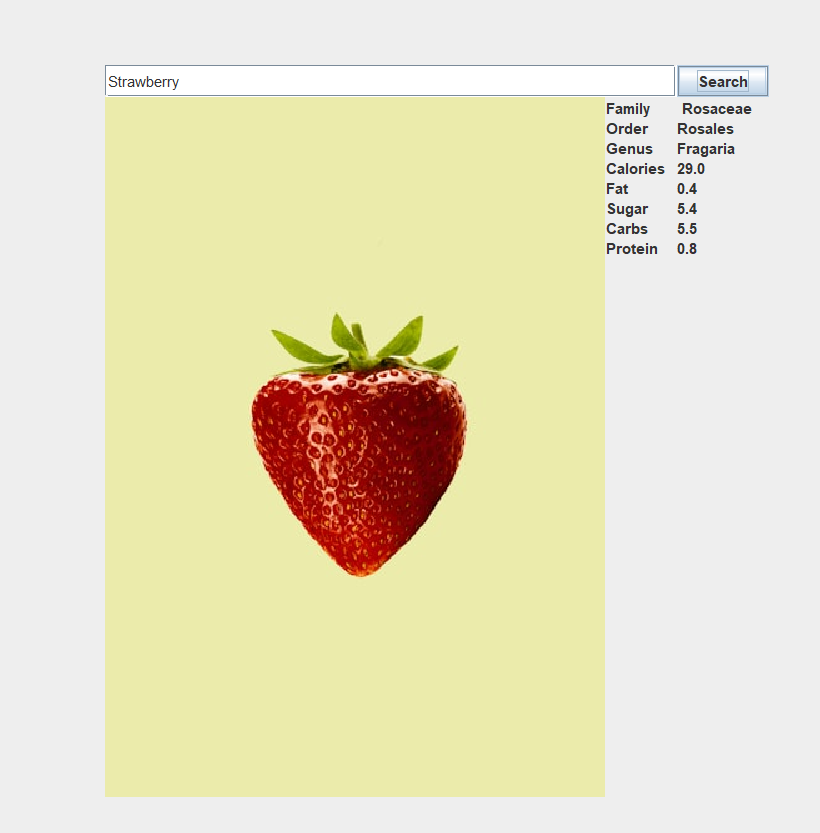

### Fruity Vice

Created an interface that the user enters a fruit and it pulls the facts about that fruit 
an online site called fruityvice.com and it pulls a picture of that fruit with it from unsplash.com

### Screenshots

#### Links

- [GridBagLayout](https://docs.oracle.com/javase/tutorial/uiswing/layout/gridbag.html)
- [Junit](https://junit.org/)
- [FruityVice](https://fruityvice.com/)
- [Unsplash](https://unsplash.com/)