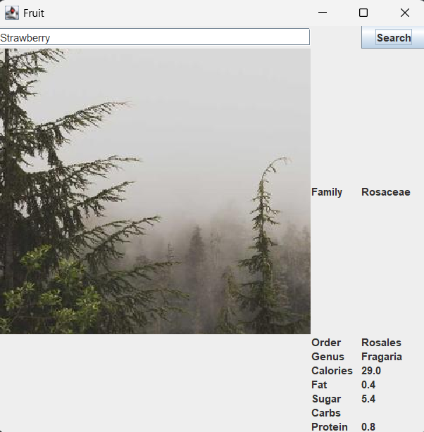

### Fruity Vice

Created an interface that the user enters a fruit and it pulls the facts about that fruit 
an online site called fruityvice.com
The goal is for it to also into the a picture of the fruit currently it just pulls a random picture

### Screenshots

#### Links

- [GridBagLayout](https://docs.oracle.com/javase/tutorial/uiswing/layout/gridbag.html)
- [Junit](https://junit.org/)
- [FruityVice](https://fruityvice.com/)